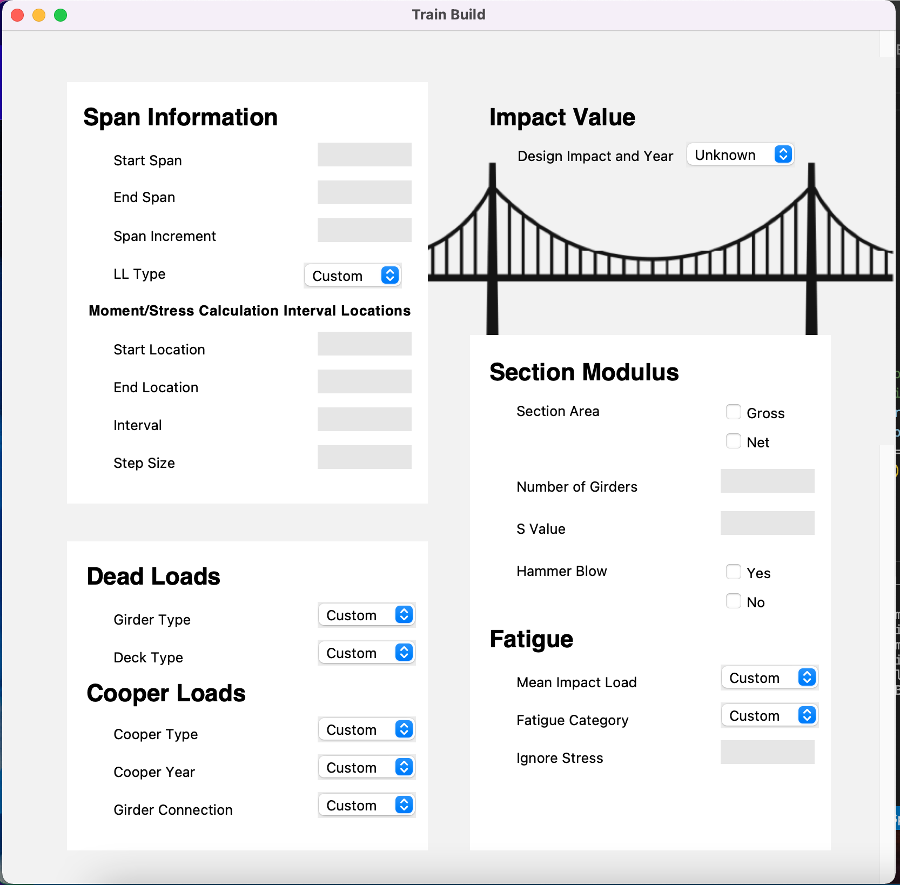
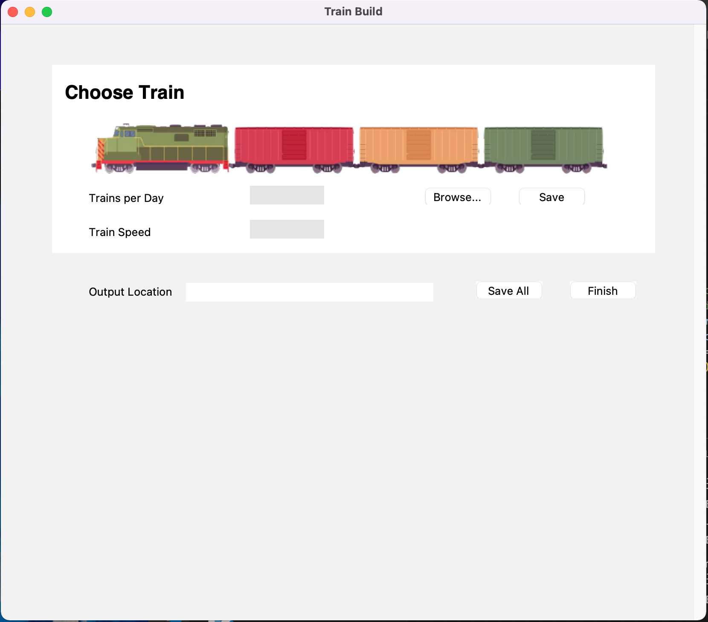
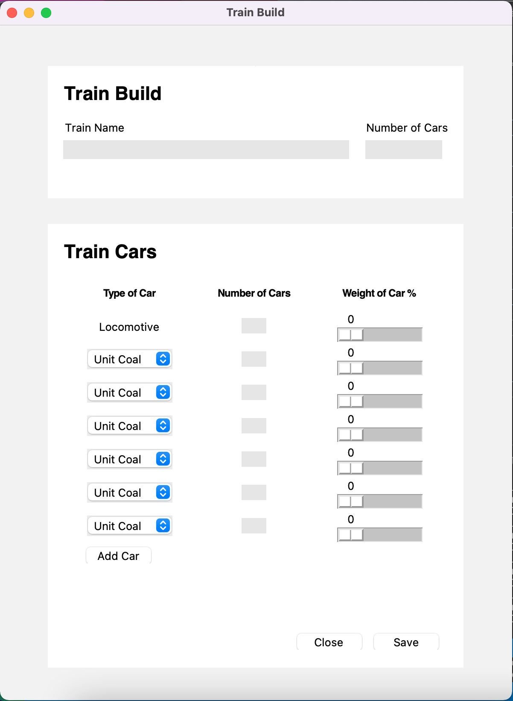

# Railroad Analysis
As a structural engineering researcher at Purdue University Lyles School of Civil Engineering (Bowen Laboratory), I took on a roll of software engineer for a brief moment for an adjacent lab group. 
We are working on a Python GUI to run railroad bridge simulations. I took the visual code and mocked up aesthetically pleasing interfaces.

The first part is an analysis page.

The second part is building a train.

